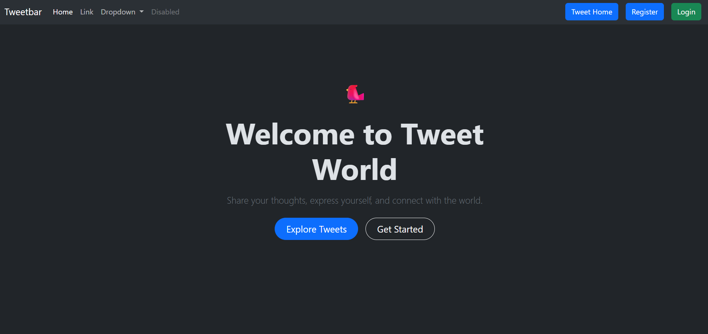
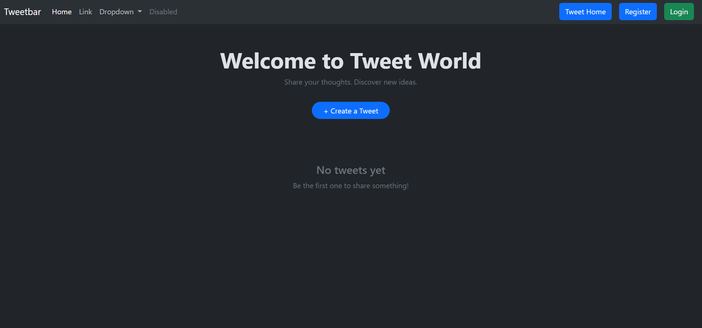
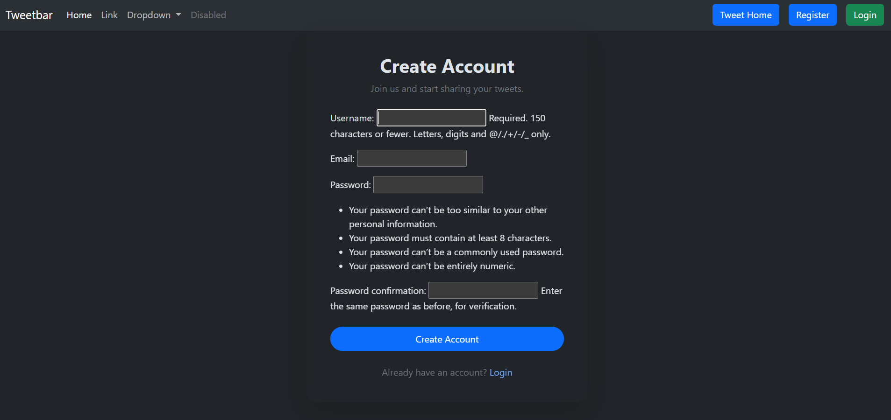
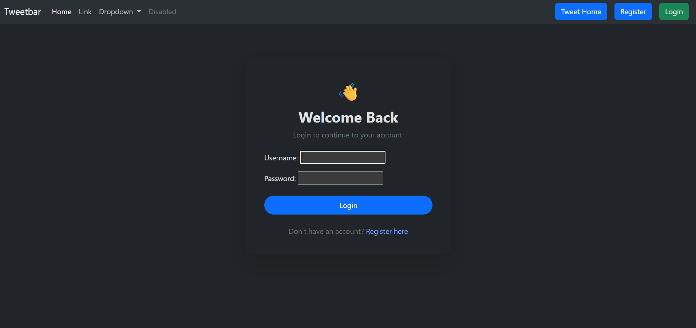
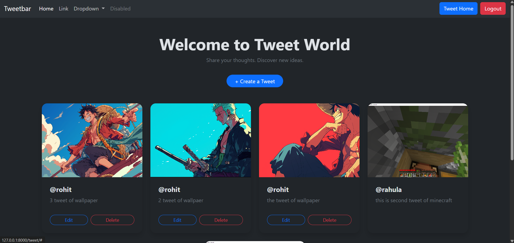
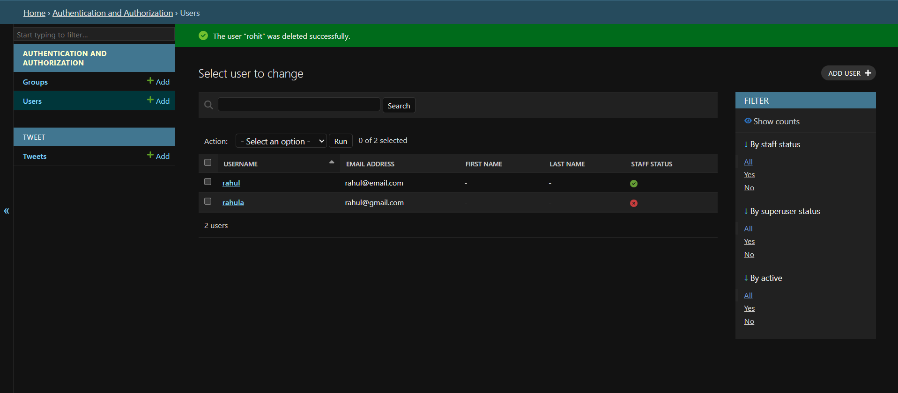

# Tweet World 🐦

Tweet World is a Django-based social media web application where users can register, authenticate, and create, view, edit, and delete tweets. Users can optionally upload images with tweets. The project uses Django authentication and authorization with a responsive Bootstrap 5 dark UI.

## ✨ Features

- 🔐 **Authentication**
  - User registration
  - User login
  - User logout
  - Django password validation
  - Session-based authentication

- 🛡️ **Authorization**
  - Login required for creating, editing, and deleting tweets
  - Users can edit/delete only their own tweets
  - Tweet ownership is checked at the view level

- 📝 **Tweet CRUD**
  - Create tweets
  - View tweets
  - Edit tweets
  - Delete tweets
  - Tweets displayed newest first

- 🖼️ **Image Upload**
  - Optional image upload with tweets
  - Uploaded images displayed on tweet cards

- 🎨 **UI**
  - Bootstrap 5
  - Dark theme
  - Responsive layout
  - Welcome, registration, login, tweet feed, and confirmation screens

- ⚙️ **Django Admin**
  - Manage users
  - Manage tweets

## 🔄 Project Flow

```text
                    Welcome Page
                         |
             +-----------+-----------+
             |                       |
        Get Started            Explore Tweets
             |                       |
             v                       v
        Registration           Tweet World
             |                       |
             v                       |
           Login                     |
             |                       |
             +-----------+-----------+
                         |
                         v
                    Tweet World
                         |
             +-----------+-----------+
             |           |           |
           Create      Edit       Delete
             |           |           |
             +-----------+-----------+
                         |
                         v
                   Updated Feed
```

## 🔐 Authentication Flow

1. User opens the **Register** page.
2. User creates an account.
3. Django validates the registration form and password.
4. The user is logged in after successful registration.
5. Authenticated users can create, edit, and delete their own tweets.
6. Users can log out using the Logout button.
7. Users can log in again using their username and password.

## 🛡️ Authorization

The application protects tweet management using Django's `login_required` decorator.

Edit and delete operations also verify tweet ownership:

```python
get_object_or_404(Tweet, pk=tweet_id, user=request.user)
```

This prevents a logged-in user from editing or deleting another user's tweet through these views.

## 📝 Tweet CRUD Flow

### Create
Logged-in users select **Create a Tweet**, enter text, optionally upload an image, and submit.

### Read
The Tweet World page displays all tweets in reverse chronological order.

### Update
The owner selects **Edit**, changes the tweet, and submits the updated form.

### Delete
The owner selects **Delete**, confirms the action, and the tweet is removed.

## 🧰 Tech Stack

| Technology | Usage |
|---|---|
| Python | Programming language |
| Django | Backend web framework |
| HTML5 | Page structure |
| CSS3 | Styling |
| Bootstrap 5 | Responsive UI |
| SQLite | Database |
| Django Authentication | Registration, login, logout |
| Django ModelForms | Forms |
| Git & GitHub | Version control |

# 📸 Screenshots

The screenshots below are included in this repository under `tweet-world-screenshots/`.

## 1. Welcome Page

The landing page introduces Tweet World and provides options to explore tweets or create an account.



---

## 2. Tweet World — Empty State

The tweet feed displays a friendly message when there are no tweets yet.



---

## 3. User Registration

Users can create a new account using the registration form with Django's password validation.



---

## 4. User Login

Existing users can log in using their username and password.



---

## 5. Tweet Feed

The main Tweet World page displays tweet images, usernames, tweet content, and Edit/Delete options for the current user's tweets.



---

## 6. Django Admin

The Django admin panel allows administrators to manage registered users and tweets.



## 📁 Project Structure

```text
DJANGOFINAL/
│
├── README.md
├── manage.py
│
├── tweet/
│   ├── models.py
│   ├── views.py
│   ├── forms.py
│   ├── urls.py
│   └── templates/
│       ├── welcome.html
│       ├── tweet_list.html
│       ├── tweet_form.html
│       ├── tweet_confirm_delete.html
│       └── registration/
│           ├── register.html
│           └── login.html
│
├── tweetheadq/
│   ├── settings.py
│   ├── urls.py
│   └── ...
│
└── tweet-world-screenshots/
    ├── 01-welcome-page.png
    ├── 02-tweet-list-empty.png
    ├── 03-registration-page.png
    ├── 04-login-page.png
    ├── 05-tweet-list.png
    └── 06-django-admin-users.png
```

## ⚙️ Installation

```powershell
git clone <your-github-repository-url>
cd DJANGOFINAL

python -m venv .venv
.venv\Scripts\Activate.ps1

pip install django

python manage.py makemigrations
python manage.py migrate
python manage.py createsuperuser
python manage.py runserver
```

Open:

```text
http://127.0.0.1:8000/
```

Admin:

```text
http://127.0.0.1:8000/admin/
```

## 🎯 Learning Outcomes

This project demonstrates practical experience with Django project structure, URL routing, views, templates, ModelForms, CRUD operations, authentication, authorization, password handling, image uploads, database migrations, Django Admin, responsive Bootstrap UI, and Git/GitHub.

## 🔮 Future Improvements

- Likes and comments
- User profiles
- Follow/unfollow
- Search and filtering
- Pagination
- Tweet timestamps
- REST API
- Cloud deployment

## 👨‍💻 Project

**Tweet World — Django Social Media Web Application**

A full-stack Django project built to practice authentication, CRUD functionality, database operations, image uploads, authorization, and responsive web UI.
